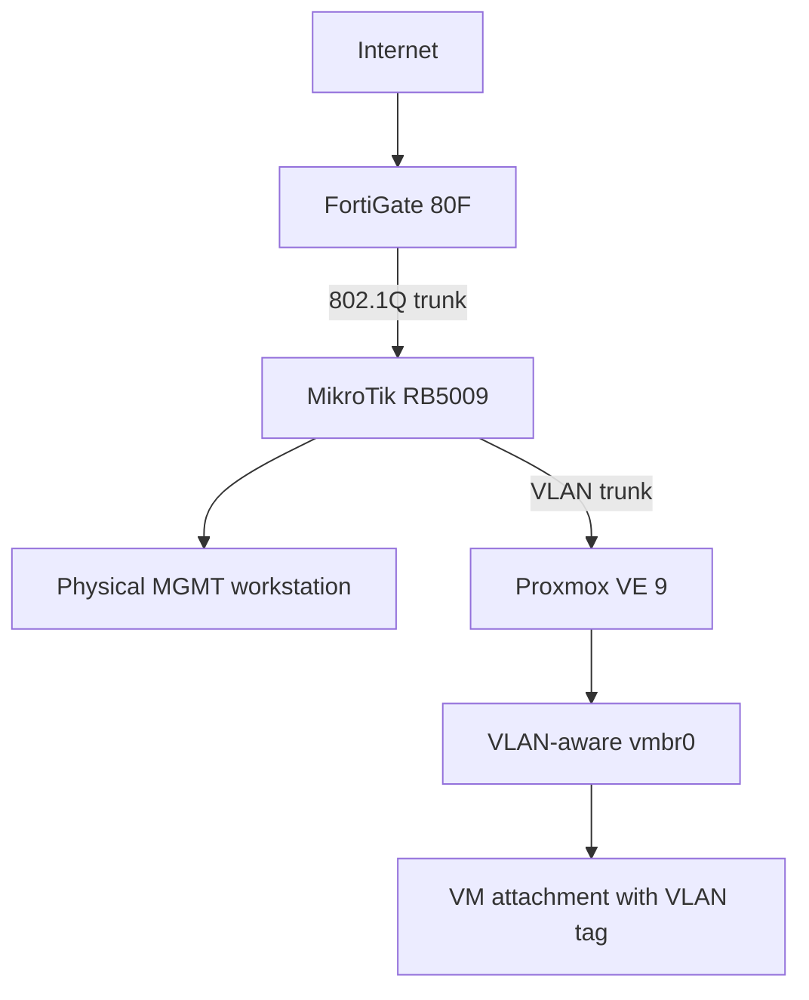

# Current architecture checkpoint

**CONFIRMED CURRENT STATE** — sanitized from supplied context plus live read-only discovery completed during Phase P0. Real addressing, host identifiers, WAN data, credentials, MAC addresses, serial numbers and raw device exports are intentionally absent.

## Physical topology

The workstation is on VLAN10; its switch-port configuration is not documented here. Proxmox management and the dedicated Proxmox/API Twingate connector are in VLAN20. No device port numbers, WAN endpoints or host addresses are published.

## Component responsibilities

| Component | Confirmed facts | Unconfirmed detail |
| --- | --- | --- |
| FortiGate | 80F, FortiOS 7.6.2, NAT mode, standalone, no system zones; live audit confirmed VLAN interfaces/gateways, routing, DHCP, DNS settings, firewall policies, WAN NAT/VIPs, address objects and custom services | Recovery/bootstrap procedure, capacity assumptions and final cleanup dependencies |
| MikroTik | RB5009 downstream of FortiGate; connects workstation and Proxmox trunk | RouterOS version, exact port/PVID/tagging configuration and management address |
| Proxmox | VE 9; physical uplink to VLAN-aware `vmbr0`; VM/LXC VLAN assignment through `vmbr0` plus tag; host management in VLAN20; live VM/LXC attachment inventory reviewed | Resource/capacity plan and dependency review for preserved legacy bridges/templates |
| DNS | BIND9 and Unbound both exist in VLAN30; FortiGate itself uses BIND9; DHCP on selected existing segments advertises BIND9; Wi-Fi/DMZ use FortiGate default DNS service | Zone authority, BIND9/Unbound forwarding/recursion relationship, complete consumer map, ACLs and redundancy behavior |
| Remote administration | Dedicated Twingate connector in VLAN20 for direct Proxmox/API access | Connector policy, dependencies, availability and broader management reachability |
| Exposed services | Existing WAN-exposed DMZ/test/game services | Exact placements and flow dependencies; do not assume all test services are in VLAN50 |

## Existing logical networks

See [VLAN/IP plan](../network/vlan-ip-plan.md) for synthetic examples. Confirmed structural roles: VLAN10 MGMT; VLAN20 SRV/Proxmox; VLAN30 LAB; VLAN40 Wi-Fi; VLAN50 DMZ/Game. FortiGate performs L3 routing, DHCP and firewalling.

## Preserved legacy state

- Some existing VMs reference old `vmbr1`/`vmbr2` bridges. Their connectivity and dependencies must be established before migration.
- Some old templates use untagged networking. Do not normalize or replace them yet.
- An additional VLAN40 configuration on the main trunk uses a different subnet and came from an abandoned Home Assistant/boiler experiment. Its FortiGate binding is confirmed; active consumers/dependencies are not. Preserve it until separately reviewed.

## OPEN DECISION / discovery gaps

Privately confirm the exact RB5009 L2 configuration; BIND9/Unbound authority and query paths; complete DNS consumers; legacy bridge/template dependencies; management/recovery paths; resource capacity; and WAN/legacy cleanup dependencies. Publish sanitized conclusions only. The current-state audit does not establish an implemented AD environment, enterprise VLAN60–90 deployment, DNS migration or production automation.
