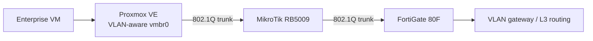

# Enterprise Infrastructure Lab — STATUS

**Last updated:** 2026-09-13  
**Status:** Active  
**Current execution phase:** Manual pilot / first vertical slice  
**Next implementation target:** complete the M2 controlled failure drills for `DC01`

---

## 1. Project purpose

This repository documents a temporary enterprise infrastructure training environment built on top of an existing HomeLab.

The goal is to gain hands-on experience with:

- Windows Server
- Active Directory Domain Services
- AD-integrated DNS
- Group Policy
- Windows domain clients
- SMB / NTFS permissions
- Linux domain integration
- VLAN segmentation and routing
- firewall policy design
- monitoring
- patching
- backup and restore
- troubleshooting
- PowerShell
- Ansible
- Terraform
- later network automation and CI/CD

The environment is not intended to become permanent production infrastructure.

### Lifecycle

`build manually → document → break → troubleshoot → automate → destroy → rebuild → verify → final teardown`

The permanent HomeLab is the hosting platform. The Enterprise Lab is an ephemeral training workload.

---

## 2. Public / private boundary

This repository is public-safe.

Public documentation uses:

- synthetic subnets
- generic hostnames
- example domains
- sanitized architecture descriptions

The following must remain outside the public repository:

- real internal addressing
- WAN addressing
- MAC addresses
- serial numbers
- credentials
- tokens
- SSH private keys
- raw FortiGate exports
- raw MikroTik exports / backups
- environment-specific mapping
- Terraform state containing real values

Raw baseline and operational evidence are stored in a separate private location.

---

## 3. Current milestone

### Enterprise network foundation

**Status: COMPLETE — validated end-to-end**

Two dedicated enterprise VLANs were added for the first vertical slice.

| VLAN | Role | Public example subnet | Status |
| --- | --- | --- | --- |
| 60 | ENT-SERVERS | `10.250.60.0/24` | PASS |
| 70 | ENT-CLIENTS | `10.250.70.0/24` | PASS |

> The subnets above are synthetic examples and are not the real HomeLab addressing.

---

## 4. Confirmed infrastructure path

### Responsibilities

**FortiGate 80F**
- central L3 gateway
- inter-VLAN routing
- firewall policy
- DHCP where required
- WAN NAT / VIP for existing HomeLab services

**MikroTik RB5009**
- L2 VLAN transport
- VLAN-aware bridge
- no ENT-LAB L3 gateway role

**Proxmox VE**
- hosts the enterprise VMs
- `vmbr0` is VLAN-aware
- guest VLAN membership is assigned with a NIC VLAN tag

---

## 5. Baseline before implementation

A PRE-LAB baseline was captured before Enterprise Lab changes.

Baseline categories:

- FortiGate configuration / discovery
- MikroTik RouterOS export and binary backup
- Proxmox network and guest inventory

The baseline is private and is not committed to this repository.

### Final teardown requirement

At the end of the project:

1. destroy the Enterprise Lab;
2. compare the resulting HomeLab state with the PRE-LAB baseline;
3. investigate any unexpected drift;
4. confirm that Enterprise Lab changes were removed.

---

## 6. Live discovery completed

### FortiGate

Confirmed:

- FortiGate 80F
- FortiOS 7.6.2
- standalone NAT mode
- root VDOM
- no system zones currently configured
- FortiGate provides L3 routing and firewalling
- existing HomeLab VLANs and routes were reviewed live
- DHCP, DNS settings, policies, VIPs, address objects and custom services were reviewed privately

### MikroTik

Confirmed:

- RB5009UG+S+
- RouterOS 7.18.2
- ARM64
- 1 GB RAM
- `bridge1` uses VLAN filtering
- tagged trunk exists toward FortiGate
- tagged trunk exists toward Proxmox
- existing VLAN transport works
- firewall filter and NAT tables are empty

A separate direct local management path from the main workstation to the MikroTik also exists.

### Proxmox

Confirmed:

- Proxmox VE 9
- `vmbr0` is VLAN-aware
- guest VLAN membership is assigned by NIC tag
- existing HomeLab guests and legacy network references were reviewed
- legacy state is documented but is out of scope for Enterprise Lab cleanup

---

## 7. Enterprise Lab changes implemented

### FortiGate

Created:

- `vlan60_ent_srv` — ENT-LAB Servers
- `vlan70_ent_cli` — ENT-LAB Clients

Both:

- use the existing trunk parent
- have FortiGate as the VLAN gateway
- allow ICMP for validation
- have FortiIPAM management disabled so addressing can be configured manually

No enterprise DHCP or general firewall policy has been added yet.

### MikroTik

Added tagged transport for:

- VLAN60 between FortiGate trunk and Proxmox trunk
- VLAN70 between FortiGate trunk and Proxmox trunk

The MikroTik has no ENT-LAB IP address in either VLAN.

### Proxmox

No bridge reconfiguration was required because the existing VLAN-aware bridge already permits the required VLAN IDs.

---

## 8. Validation evidence

A disposable Linux VM was used as an end-to-end network probe.

### VLAN60 validation

Verified:

- guest NIC attached to VLAN60
- static address configured
- correct default route
- FortiGate VLAN60 gateway reachable
- ICMP result: **4/4 replies, 0% loss**

**Result: PASS**

### VLAN70 validation

The same VM was moved to VLAN70.

Verified:

- guest NIC attached to VLAN70
- static address configured
- correct default route
- FortiGate VLAN70 gateway reachable
- ICMP result: **4/4 replies, 0% loss**

**Result: PASS**

### Proven path

`VM → Proxmox vmbr0 → MikroTik trunk → FortiGate gateway`

Both enterprise VLANs are operational end-to-end.

---

## 9. Pre-existing HomeLab finding

During baseline work, a MikroTik control-plane connectivity issue was discovered.

Observed:

- normal VLAN transit switching works;
- the MikroTik management control plane cannot complete normal L3 connectivity to the management gateway;
- the upstream FortiGate receives the MikroTik ARP request;
- the FortiGate emits the ARP reply;
- the MikroTik does not complete ARP resolution;
- temporarily removing an additional legacy address did not resolve the issue.

### Decision

**Parked as existing HomeLab technical debt.**

It does not block the Enterprise Lab and must not cause unrelated redesign of the existing HomeLab during this project.

---

## 10. Pre-lab hygiene changes

The following small HomeLab hygiene changes were made before the final baseline:

- MikroTik timezone corrected to `Asia/Jerusalem`
- MikroTik system clock corrected
- FortiGate NTP server capability enabled on the existing management network

MikroTik NTP synchronization remains unresolved because of the pre-existing control-plane connectivity finding.

This is not an Enterprise Lab blocker.

---

## 11. Current service state

The enterprise VLANs currently provide only the minimum network foundation.

### Implemented

- VLAN60 transport
- VLAN70 transport
- FortiGate gateways
- Proxmox VLAN attachment
- end-to-end ICMP validation

### Not implemented yet

- DHCP for enterprise VLANs
- enterprise Internet access policy
- VLAN60 ↔ VLAN70 access policy
- Active Directory
- AD DNS
- DC01
- DC02
- Windows domain clients
- GPO
- file server
- Linux domain integration
- monitoring
- patch-management design
- backup / restore workflows
- IaC deployment
- automated teardown / rebuild

---

## 12. Current architecture decisions

### Accepted

- FortiGate remains the central L3 gateway/firewall.
- MikroTik remains primarily L2 transport for ENT-LAB.
- Proxmox uses tagged guest NICs rather than dedicated host L3 subinterfaces for ENT-LAB.
- The main HomeLab administration workstation will not be the first domain client.
- Existing HomeLab legacy state is out of scope unless it directly blocks ENT-LAB.
- Enterprise Lab must be removable without leaving unplanned HomeLab drift.
- Real environment data stays outside the public repository.

### Still open

- DHCP ownership / scope design
- RSAT / administrative workstation placement
- monitoring placement
- backup / restore implementation
- final automation ownership boundaries
- RSAT / administrative workstation placement
- monitoring placement
- backup / restore implementation
- final automation ownership boundaries

Open decisions should be resolved just-in-time when they block the next vertical slice.

---

## 13. Current project progress

| Area | State |
| --- | --- |
| Repository bootstrap | DONE |
| Public/private boundary | DONE |
| FortiGate discovery | DONE |
| MikroTik discovery | DONE |
| Proxmox discovery | DONE |
| PRE-LAB baseline | DONE |
| VLAN60 ENT-SERVERS | DONE |
| VLAN70 ENT-CLIENTS | DONE |
| End-to-end VLAN validation | DONE |
| DC01 core build | DONE |
| AD DS / DNS | DONE |
| DC01 controlled failure drills | NEXT |
| WIN11-01 | NOT STARTED |
| OU / Users / Groups | NOT STARTED |
| First GPO | NOT STARTED |
| DC02 | NOT STARTED |
| File Server / SMB / NTFS | NOT STARTED |
| Linux domain join | NOT STARTED |
| Monitoring | NOT STARTED |
| Patch / backup / restore scenarios | NOT STARTED |
| PowerShell automation | NOT STARTED |
| Ansible | NOT STARTED |
| Terraform | NOT STARTED |
| Network as Code | NOT STARTED |
| Destroy / rebuild validation | NOT STARTED |
| Final teardown | NOT STARTED |

---

## 14. NEXT ACTION — M2 controlled failure drills

The first domain controller has been built manually and passed the initial
health-validation gate.

### Completed M2 implementation

- Windows Server 2025 installed manually.
- `DC01` deployed on VLAN60 / ENT-SERVERS.
- Static server networking configured and gateway reachability validated.
- First Active Directory forest created.
- AD-integrated DNS installed and validated.
- Required LDAP/DC discovery SRV records validated.
- `SYSVOL` and `NETLOGON` shares validated.
- Domain Controller advertising, services, Netlogon, SYSVOL and DNS tests passed.
- All five FSMO roles are held by `DC01`, as expected for the first DC.
- DNS forwarding through the existing HomeLab resolver was validated.
- Minimal firewall access was implemented for required DNS and outbound services.
- The PDC Emulator was configured to use an external NTP source and successful
  synchronization was validated.

Public documentation intentionally omits the real AD namespace, host addresses,
resolver addresses and WAN details.

### Remaining M2 work

Execute and document the controlled failure scenarios already defined in the
MASTER PLAN:

1. stop the DNS service and observe the impact;
2. introduce an incorrect DNS configuration and diagnose the symptoms;
3. break time synchronization and record the diagnostic evidence;
4. restore the known-good configuration after each test;
5. run the final DC health checks again.

After those drills pass and recovery is verified, M2 can be closed and the next
implementation slice becomes:

`WIN11-01 → VLAN70 → AD DNS → first domain join`

---

## 15. Session continuation rule

This file is the public project status, not the full private operational handoff.

At the end of each meaningful work session:

1. update completed work;
2. add validation evidence;
3. record new findings;
4. update open decisions;
5. set exactly one clear `NEXT ACTION`;
6. commit the updated status together with the related project documentation.

A new session should begin from `NEXT ACTION` rather than repeating completed discovery.
